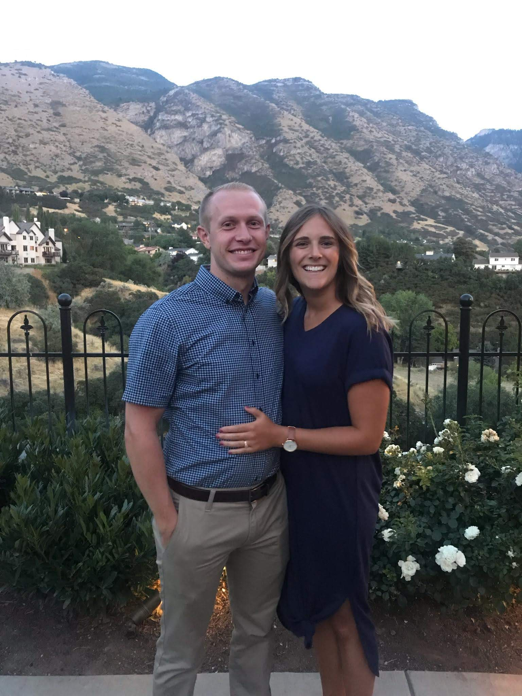
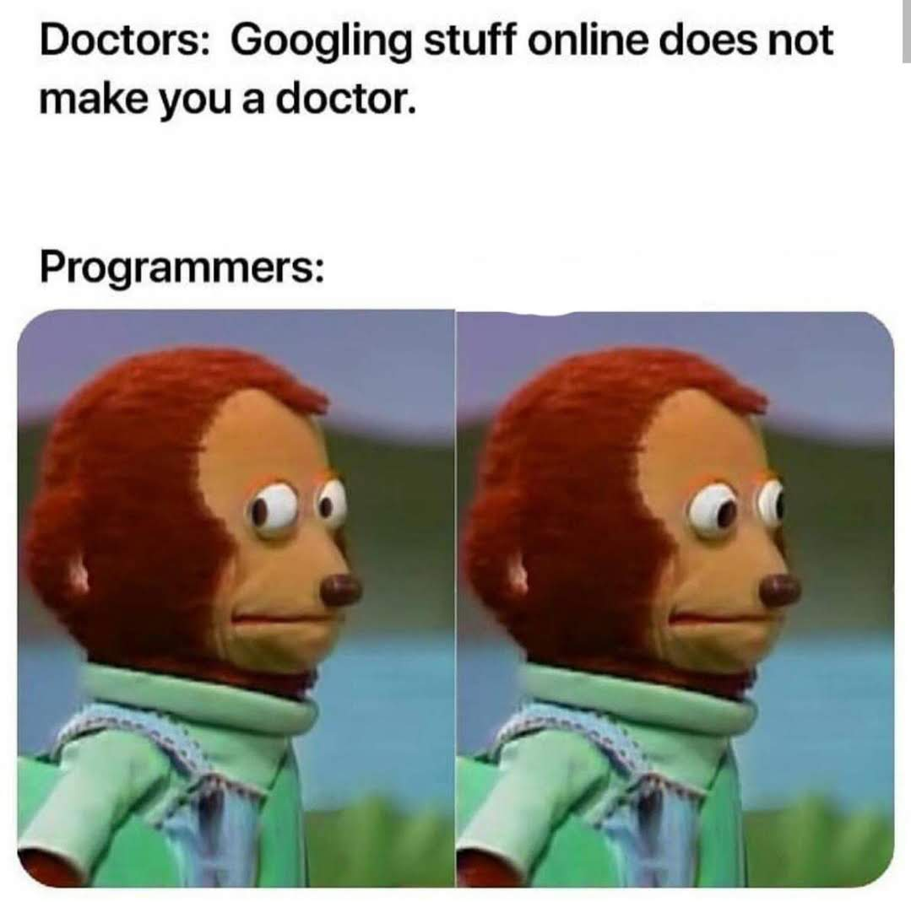

# About Me

My name is Matt Oehler. I received my bachelors degree in statistics from Brigham Young Univeristy, and now I'm working as a data analyst at Progressive Leasing in Draper, Utah. I specifically work on the fraud detection/prevention team and I absolutely love it. 

Outside of work, I do my best to live life to its fullest, and I feel incredibly blessed to be surrounded with the means and  opportunities to do so.
I lead a a very active lifestyle, and I'm currently participating in several recreation sports leagues for basketball, volleyball, and ultimate frisbee. Other things I enjoy include hiking, wakeboarding, learning everyday, and programmer memes.

I'm also lucky to be married to an incredible woman who supports me in all that I do and even competes alongside me in several of the sports leagues I just mentioned.

<table>
    <tr>
        <td>
            
        </td>
        <td>
            
        </td>

	<td>
            
        </td>
    </tr>
</table>

