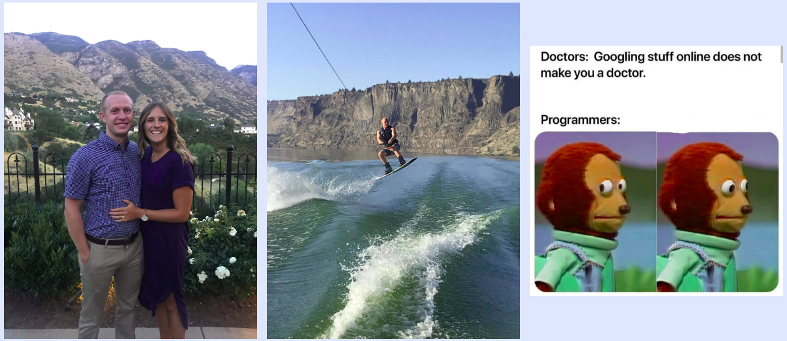

# About Me

My name is Matt Oehler. I received my bachelors degree in statistics from Brigham Young Univeristy, and now I'm working as a data analyst at Progressive Leasing in Draper, Utah. I specifically work on the fraud detection/prevention team and I absolutely love it. 

Outside of work, I do my best to live life to its fullest, and I feel incredibly blessed to be surrounded with the means and  opportunities to do so.
I lead a a very active lifestyle, and I'm currently participating in several recreation sports leagues for basketball, volleyball, and ultimate frisbee. Other things I enjoy include hiking, wakeboarding, learning everyday, and programmer memes.

I'm also lucky to be married to an incredible woman who supports me in all that I do and even competes alongside me in several of the sports leagues I just mentioned.

Find me on [LinkedIn](https://www.linkedin.com/in/mattoehler/)

## Education
___
#### **Brigham Young University –  College of Physical and Mathematical Sciences**
- *Bachelors of Statistics | Minor in Mathematics*

#### **Relevant Courses**
**Bolded** courses are graduate level
- Modern Regression Methods (**Stat 536**)
- Correlated Data Analysis (Stat 469)
- R Programming (Stat 123/Stat 223)
- Bayesian Statistics (Stat 151/Stat 451)
- Linear Models (Stat 330/**Stat 535**)
- Mixed Models (**Stat 537**)
- Statistical Computing (**Stat 624**)
- Probability Theory (Stat 240, Stat 340, **Stat 641, Stat 642**)
- Applied Machine Learning (Econ 213R)
- Deep Learning (**CS 501R**)
- Data Structures (CS 235)
- Advanced Programming Concepts (CS 240)
    
## Relevant Projects
___
- Portfolio and Publications: https://mjoehler94.github.io
- Github Repositories: https://github.com/mjoehler94

## Skills
___
- Python, R/R-Shiny, SQL, Java, C++, JAGS, Git, LaTeX
- Communication - public speaking, giving presentations, explaining project details at an executive level
- Korean Language - speaking, reading, and writing

## Experience
___
#### **Progressive Leasing**
*Data Analyst – Risk Operations Team*
- Develop and quantify the impact of new fraud prevention systems to mitigate financial damages from fraud
- Designed and automated data flow to identify characteristics and behavior of fraudulent customers

#### **Orderboard Inc.**
*Data Science Consultant*
- Designed and tuned classification models to identify qualified candidates for the job openings of our clients

#### **BYU Department of Statistics**
*Research Assistant (Sports Statistics)*
- Created a Markov chain simulation program to study professional beach volleyball teammate configurations
- Presented findings at 2018 Joint Statistical Meetings in Vancouver, Canada

#### **University of Utah Health Services**
*Data Science Intern*
- Created a web app enabling executives to visualize disease prevalence and strategically expand care facilities
- Merged healthcare data from multiple sources to facilitate future insight extraction and statistical modeling

#### **BYU Department of Mathematics**
*Research Assistant (Data Science)*
- Implemented an SVM model to classify documents by topic to improve the MathFeeds iOS app
- Researched and applied modern methods of natural language processing

#### **IM Flash Technologies**
*Process Technician Intern*
- Created an analysis framework to calculate and assess the failure rate of tool maintenance protocols
- Increased tool availability time of the Physical Vapor Deposition manufacturing section by 1.2%

#### **TaxHawk Inc.**
*Statistical Analyst Intern*
- Modeled online customer behavior using logistic regression
- Scheduled report deadlines and delegated team assignments to ensure timely completion of the project

#### Other
___                               
- Repeat publisher on https://towardsdatascience.com
